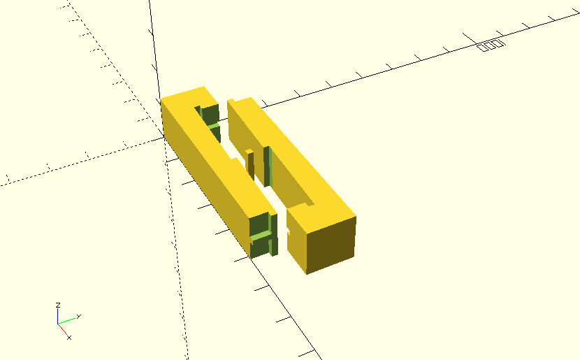
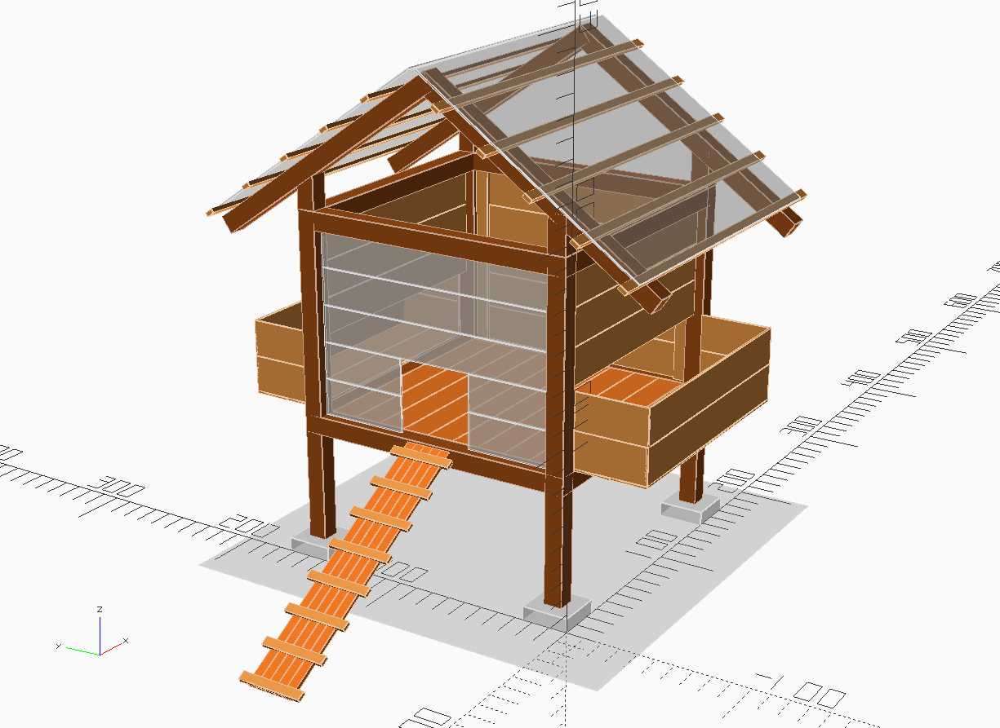

# openscad-models

My OpenSCAD models of joints and projects.

Things that I am really making and/or have made are actually using
the revision control with commit history (things in the `thethings/` directory).

The vendored libraries are also following this pattern, changes to versions and/or source
should be called out somewhere.

## TODO
- git-lfs
- take dimlines idea and make it much easier to build (not so many arbitrary translations)
- linter

## Vendored 3rd party libraries

- libraries/dimlines [website](http://www.cannymachines.com/entries/9/openscad_dimensioned_drawings)
- libraries/ruler
- libraries/TextGenerator
- libraries/write

## Examples

### Kanawa Tsugi
Half blind, dadoed and rabbetted scarf joint.

### Door

### Dog Toy Box

### Chicken Coop

### Bed Frame

